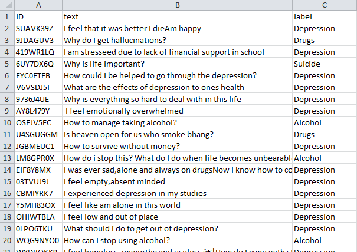

# ZindiAfrica- Basic Needs Basic Rights Kenya - Tech4MentalHealth
**Rank 31 Solution for Basic Needs Basic Rights Kenya - Tech4MentalHealth** \
The objective of this challenge is to develop a machine learning model that classifies statements and questions expressed by university students in Kenya when speaking about the mental health challenges they struggle with. The four categories are depression, suicide, alchoholism, and drug abuse.
## Data at a Glance

## Description of my Methodology/Approach
- Tried LSTM based Approach which gave a score of 0.43 in public and 0.42 in private
- Used SimpleTransformers Roberta-base OOF 10-splits for final model making
## Tools used
1. Python for programming
2. pandas and numpy libraries for methodology
3. SimpleTransformers,Tensorflow and keras library for the model
4. matplotlib and seaborn was used for plotting and analyzing the data
## Competition Result
Rank: 64th on public LB and 31st on private LB\
[Link to LeaderBoard](https://zindi.africa/competitions/basic-needs-basic-rights-kenya-tech4mentalhealth/leaderboard)
